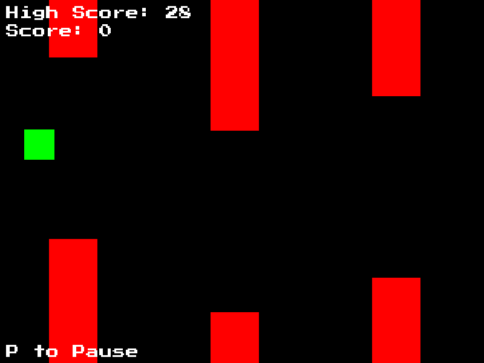

# Retro Flap

[](LICENSE)

A retro-style Flappy Bird clone created using C and SDL2.



## Play

The required Windows .dlls are included with the Windows binary.

On Linux, you need to install the following SDL2 dependencies:

**Fedora:**

```bash
sudo dnf install SDL2 SDL2_ttf SDL2_mixer
```

**Debian:**

```bash
sudo apt install libsdl2-2.0-0 libsdl2-mixer-2.0-0 libsdl2-ttf-2.0-0
```

## Building on Linux

I have only built the game on Linux, for Linux and Windows. The game is built using Make, compiled with GCC for Linux and MINGW32 GCC for Windows.

It relies on the following dependencies:

- SDL2
- SDL2_ttf
- SDL2_mixer

The required files to build for Windows are already included in lib.

To build for Linux, you can easily get them using your package manager. To be able to build the project, make sure to install the development versions of these packages like shown in the examples:

**Fedora:**

```bash
sudo dnf install SDL2-devel SDL2_ttf-devel SDL2_mixer-devel
```

**Debian:**

```bash
sudo apt install libsdl2-dev libsdl2-ttf-dev libsdl2-mixer-dev
```

After you have everything you need, you can run the following commands:

```bash
make # to build for Windows and Linux
make directories # to make sure you have the build directories
make linux # to build for Linux only
make windows # to build for Windows only
make run # to run the Linux executable
make winrun # to run the Windows executable
```

Running the Windows executable with Wine seems to work well for testing the Windows version on Linux.

## License

This project is licensed under the [MIT License](LICENSE).
